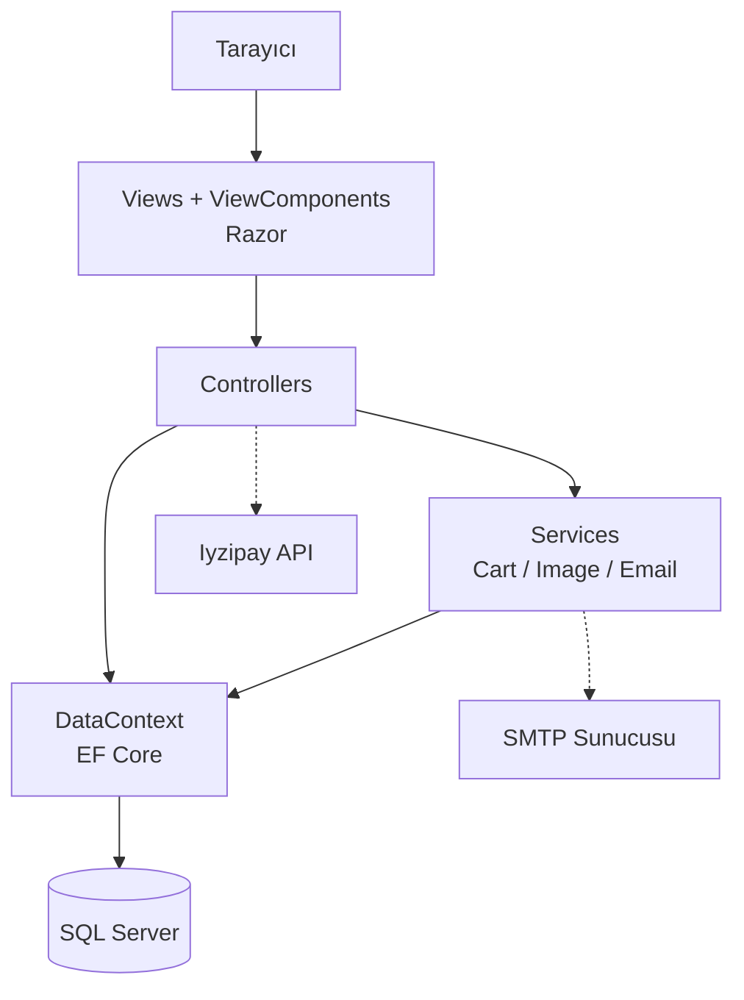
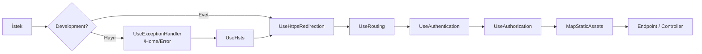

# 01 — Mimari Genel Bakış

## Klasör Yapısı

```text
Controllers/      MVC controller'ları (10 adet)
Data/             Entity sınıfları + DataContext + seed
Migrations/       EF Core migration'ları
Models/           View model / form model sınıfları (klasör bazlı gruplu)
Services/         Sepet, görsel ve e-posta servisleri
ViewComponents/   Navbar ve Slider bileşenleri
Views/            Razor view'ları (+ Shared/Partials)
wwwroot/          css, js, img, lib — statik dosyalar
Tests/            xUnit test projesi (ana projeden hariç tutulur)
build-check/      Yardımcı script çıktıları (git'e girmez)
```

`Data/` klasöründeki sınıfların namespace'i `dotnet_store.Models`'tir — klasör adı ile
namespace burada bilinçli olarak ayrışıyor. `Models/` altındaki form model'leri de aynı
namespace'i kullanır, bu yüzden view'larda ekstra `using` gerekmez.

## Katmanlar



Katmanlar arası kural basit:

- **Controller'lar** ince tutulmaya çalışılmıştır; ancak birçoğu `DataContext`'e doğrudan
  erişir (repository katmanı yoktur).
- **Sepet mantığı** controller'da değil, `ICartService` + `Cart` entity metodlarındadır.
- **İş kuralları** (toplam hesabı, sepete ekleme/çıkarma) domain sınıflarının kendi
  metodlarında durur — bkz. `Data/Cart.cs`, `Data/Orders.cs`.

## Uygulama Başlangıcı (`Program.cs`)

### Servis Kayıtları

| Kayıt | Yaşam Süresi | Amaç |
|---|---|---|
| `IEmailService` → `SmtpEmailService` | Transient | Parola sıfırlama e-postası |
| `ICartService` → `CartService` | Transient | Sepet işlemleri |
| `ImageService` | Transient | Görsel yükleme/boyutlandırma |
| `IHttpContextAccessor` | Singleton (framework) | `CartService` içinde cookie/kullanıcı erişimi |
| `AddControllersWithViews()` | — | MVC + Razor |
| `DataContext` | Scoped | EF Core, `UseSqlServer` |
| `AddIdentity<AppUser, AppRole>()` | — | Kullanıcı/rol yönetimi + token provider'lar |

Bağlantı dizesi `ConnectionStrings:DefaultConnection` anahtarından okunur.

> `Program.cs` içinde `options.UseSqlServer(...)` çağrılırken yorum satırında hâlâ
> "Sqlite kullanılıyor" yazıyor. Sağlayıcı SQL Server'dır; yorum eskimiştir.

### Middleware Pipeline

Sıra önemlidir; istek yukarıdan aşağıya bu sırayla geçer:



Üretimde hatalar `/Home/Error` sayfasına yönlenir ve HSTS devreye girer; geliştirmede
varsayılan developer exception page kullanılır.

Pipeline kurulduktan sonra `SeedDatabase.Initialize(app)` çağrılır ve ardından `app.Run()`
uygulamayı dinlemeye başlatır.

### Routing

İki adet konvansiyonel rota tanımlıdır:

| Rota adı | Kalıp | Varsayılan |
|---|---|---|
| `urunler_by_kategori` | `urunler/{url?}` | `Urun` / `List` |
| `default` | `{controller=Home}/{action=Index}/{id?}` | `Home` / `Index` |

Kategori rotası daha önce tanımlandığı için önceliklidir. Örnekler:

```text
/urunler/telefon            → UrunController.List(url: "telefon")
/urunler/telefon?q=apple    → UrunController.List(url: "telefon", q: "apple")
/urunler?q=apple            → UrunController.List(url: null, q: "apple")
/Urun/Details/5             → UrunController.Details(id: 5)
/                           → HomeController.Index()
```

## View Katmanı

İki ayrı layout vardır:

| Layout | Kullanım |
|---|---|
| `Views/Shared/_SiteLayout.cshtml` | Müşteriye dönük tüm sayfalar |
| `Views/Shared/_AdminLayout.cshtml` | Yönetim paneli sayfaları |

Ortak parçalar `Views/Shared/Partials/` altında `Site/` ve `Admin/` olarak ayrılmıştır
(`_Topbar`, `_Menu`, `_Footer`, `_UrunCard`, `_Message`, `_AdminCards`, `_NewOrders`, ...).

Bootstrap 5.3 ve Font Awesome 6.7 CDN üzerinden yüklenir; projeye ait stiller
`wwwroot/css/site.css` ve `admin.css` dosyalarındadır. Koyu tema tercihi
`localStorage["dotnet-store-theme"]` anahtarında saklanır ve `<head>` içindeki inline
script ile sayfa boyanmadan uygulanır (flash önlenir).

## İlgili Dokümanlar

- Entity'ler ve ilişkiler → [02 — Veri Modeli](02-veri-modeli.md)
- Endpoint listesi → [03 — Controller ve Rota Referansı](03-controller-ve-rotalar.md)
- Servis detayları → [04 — Servisler ve View Component'ler](04-servisler.md)
