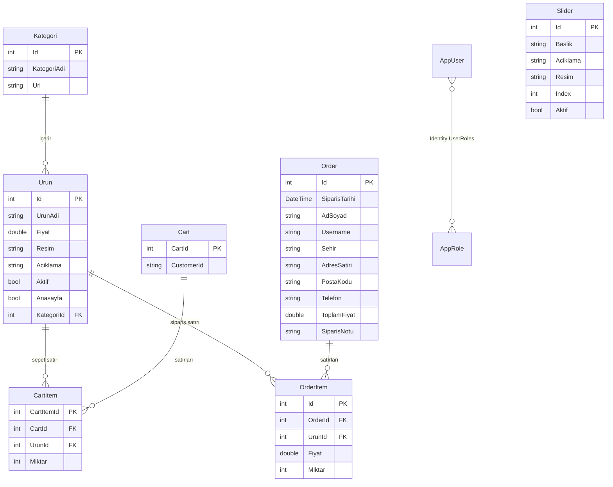

# 02 — Veri Modeli

Tüm entity'ler `Data/` klasöründe, `dotnet_store.Models` namespace'i altındadır.
Veritabanı erişimi tek bir `DataContext` üzerinden yapılır.

## ER Diyagramı

## DbSet'ler

`Data/DataContext.cs` — `IdentityDbContext<AppUser, AppRole, int>`'ten türer, dolayısıyla
Identity'nin `AspNetUsers`, `AspNetRoles`, `AspNetUserRoles` gibi tabloları da bu context
üzerinden yönetilir.

| DbSet | Entity |
|---|---|
| `Urunler` | `Urun` |
| `Kategoriler` | `Kategori` |
| `Sliderlar` | `Slider` |
| `Carts` | `Cart` (ve gezinme üzerinden `CartItem`) |
| `Orders` | `Order` (ve gezinme üzerinden `OrderItem`) |

## Entity'ler

### `Kategori`

Ürün kategorisi. `Url` alanı SEO dostu adres parçasıdır (`telefon`, `erkek-giyim`) ve
`/urunler/{url}` rotasında filtreleme anahtarı olarak kullanılır. Bir kategori birden çok
ürün içerir (1:N).

### `Urun`

Mağazadaki ürün. İki bool bayrağı davranışı belirler:

- `Aktif` — false ise ürün müşteri tarafında hiçbir listede görünmez.
- `Anasayfa` — true ise anasayfadaki öne çıkan ürünler bölümünde listelenir.

`Resim` alanı yalnızca dosya adı tutar; dosyanın kendisi `wwwroot/img/` altındadır.

### `Cart` / `CartItem`

Alışveriş sepeti. `CustomerId` alanı iki farklı şeyi tutabilir:

- Kullanıcı giriş yapmışsa → **kullanıcı adı** (`User.Identity.Name`)
- Giriş yapmamışsa → tarayıcıya yazılan **`customerId` cookie** değeri (GUID)

Sepet iş mantığı entity'nin kendi içindedir:

| Metot | Davranış |
|---|---|
| `AddItem(urun, miktar)` | Ürün sepette varsa miktarını artırır, yoksa yeni satır ekler |
| `DeleteItem(urunId, miktar)` | Miktarı azaltır; sıfır veya altına inerse satırı tamamen siler |
| `AraToplam()` | `Σ (Fiyat × Miktar)` — KDV hariç |
| `Toplam()` | `AraToplam() × 1.2` — %20 KDV dahil |

### `Order` / `OrderItem`

Tamamlanmış sipariş. Yapısı `Cart`'a benzer ama kalıcıdır: checkout sırasında sepetteki
satırlar **o anki fiyatlarıyla** kopyalanır. Bu yüzden `OrderItem.Fiyat` alanı vardır —
`Urun.Fiyat` sonradan değişse bile sipariş anındaki fiyat korunur.

`Username` alanı siparişi kullanıcıya bağlar; `OrderList` bu alana göre filtreler.
`AraToplam()` ve `Toplam()` metodları `Cart`'takiyle aynı mantıkta çalışır.

### `Slider`

Anasayfa banner kayıtları. Başka hiçbir tabloyla ilişkisi yoktur. `Aktif` olanlar
`Index` alanına göre sıralı gösterilir.

### `AppUser` / `AppRole`

ASP.NET Identity sınıflarından türetilmiştir (`IdentityUser<int>`, `IdentityRole<int>`).
`AppUser`'a eklenen tek özel alan `AdSoyad`'dır; `UserName`, `Email`, `PasswordHash` gibi
alanlar Identity'den gelir. Detay için → [05 — Kimlik Doğrulama](05-kimlik-dogrulama.md).

### `ErrorViewModel`

Veritabanı entity'si değildir. Yalnızca `Views/Shared/Error.cshtml` sayfasına request id
taşımak için kullanılır.

## Migration'lar

| Migration | İçerik |
|---|---|
| `20260517134338_InitialCreate` | Tüm tabloların ilk oluşturulması (Identity tabloları dahil) |
| `20260523154011_SeedMockData` | Örnek slider, kategori ve ürün verisinin eklenmesi |

Migration çalıştırma komutları → [07 — Kurulum ve Çalıştırma](07-kurulum-ve-calistirma.md).

## Seed Verisi

Seed iki ayrı yerden gelir — karıştırmamak önemli:

| Kaynak | Ne ekler | Ne zaman çalışır |
|---|---|---|
| `DataContext.OnModelCreating` → `HasData` | 3 slider, 10 kategori, 48 ürün | Migration uygulandığında |
| `SeedDatabase.Initialize` | `Admin` rolü + 2 kullanıcı | Uygulama her ayağa kalktığında (tablolar boşsa) |

Kategoriler: Telefon, Bilgisayar, Tablet, Erkek Giyim, Kadın Giyim, Ayakkabı, Saat,
Parfüm & Kozmetik, Aksesuar, Ev & Mobilya.

`SeedDatabase` yalnızca **hiç rol yoksa** rolü, **hiç kullanıcı yoksa** kullanıcıları
oluşturur; yani mevcut veriyi ezmez.

> Seed kullanıcılarının parolaları kod içinde sabittir ve zayıftır. Gerçek bir ortama
> çıkmadan önce mutlaka değiştirilmelidir — bkz. [08 — Geliştirme Notları](08-gelistirme-notlari.md).
