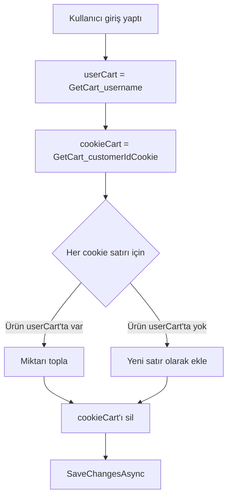

# 04 — Servisler ve View Component'ler

Servisler `Services/` klasöründedir ve `Program.cs` içinde **Transient** olarak kaydedilir.
Controller'lara constructor injection ile verilirler.

---

## `ICartService` / `CartService`

Sepetle ilgili tüm işleri toplayan servistir. Amacı, sepet mantığını controller'lardan
uzak tutmaktır.

```csharp
public interface ICartService
{
    string      GetCustomerId();
    Task<Cart>  GetCart(string customerId);
    Task        AddToCart(int urunId, int miktar = 1);
    Task        RemoveItem(int urunId, int miktar = 1);
    Task        TransferCartToUser(string username);
}
```

Bağımlılıkları: `DataContext` ve `IHttpContextAccessor`.

### Müşteri kimliği nasıl belirlenir

`GetCustomerId()` tek satırda iki durumu ele alır:

```csharp
return context?.User.Identity?.Name ?? context?.Request.Cookies["customerId"]!;
```

- **Giriş yapmışsa** → kullanıcı adı
- **Misafirse** → `customerId` cookie'si

Cookie henüz yoksa `GetCart` içinde yeni bir `Guid` üretilir ve **1 ay** ömürlü,
`IsEssential = true` işaretli bir cookie olarak yazılır.

### `GetCart(custId)`

Sepeti satırları ve satırların ürünleriyle birlikte (`Include` → `ThenInclude`) getirir.
Kayıt yoksa yeni bir `Cart` oluşturup context'e ekler. Dikkat: yeni sepeti oluştururken
`SaveChangesAsync` çağırmaz — kaydetme işi `AddToCart`/`RemoveItem` tarafına bırakılmıştır.

### `AddToCart` / `RemoveItem`

Her ikisi de önce sepeti alır, ürünün gerçekten var olduğunu doğrular, ardından `Cart`
entity'sinin `AddItem` / `DeleteItem` metodunu çağırıp değişikliği kaydeder. Miktar
hesabı ve satır silme kararı entity'nin içindedir (bkz. [02 — Veri Modeli](02-veri-modeli.md)).

### `TransferCartToUser(username)`

Giriş anında (`AccountController.Login`) çağrılır ve misafirken doldurulan sepeti
kullanıcının hesabına taşır:



---

## `ImageService`

Ürün ve slider görsellerini yükleyip normalize eder. SkiaSharp kullanır.

| Metot | Davranış |
|---|---|
| `SaveAsync(file, maxWidth, maxHeight)` | Görseli okur, oranı koruyarak küçültür, **WebP** (kalite 82) olarak kaydeder ve üretilen dosya adını döner |
| `Delete(fileName)` | Dosya varsa `wwwroot/img/` altından siler |

Önemli davranışlar:

- Dosya adı `Path.GetRandomFileName()` ile üretilir → orijinal ad kullanılmaz, çakışma ve
  path traversal riski ortadan kalkar.
- Görsel zaten sınırların altındaysa (`srcW <= maxW && srcH <= maxH`) yeniden boyutlandırma
  yapılmaz, yalnızca formatı dönüştürülür.
- Oran korunur: genişlik ve yükseklik oranlarından **küçük olanı** uygulanır.
- Hedef klasör constructor'da `IWebHostEnvironment.WebRootPath` üzerinden çözülür
  (`wwwroot/img`).

Projede kullanılan boyut sınırları:

| Çağıran | Maks. boyut |
|---|---|
| `UrunController` (Create / Edit) | 800 × 800 |
| `SliderController` (Create / Edit) | 1920 × 700 |

Düzenleme sırasında yeni görsel yüklenirse önce eski dosya `Delete` ile silinir, sonra
yenisi kaydedilir — böylece `wwwroot/img` altında yetim dosya birikmez.

Linux/Docker ortamı için `SkiaSharp.NativeAssets.Linux.NoDependencies` paketi projeye
eklenmiştir; aksi hâlde container içinde native bağımlılık hatası alınır.

---

## `IEmailService` / `SmtpEmailService`

Tek metotlu basit bir SMTP sarmalayıcısıdır:

```csharp
Task SendEmailAsync(string email, string subject, string message);
```

Ayarları `IConfiguration` üzerinden okur:

| Anahtar | Örnek |
|---|---|
| `Email:Host` | `smtp.gmail.com` |
| `Email:Username` | gönderen adres |
| `Email:Password` | uygulama parolası |

Port **587** ve `EnableSsl = true` kod içinde sabittir; gövde HTML olarak gönderilir
(`IsBodyHtml = true`). Şu an tek kullanım yeri parola sıfırlama akışıdır
(`AccountController.ForgotPassword`).

> Ayarlar `appsettings.Development.json` içindedir ve bu dosya `.gitignore`'dadır —
> git'e **girmez**. Kurulum için → [07 — Kurulum ve Çalıştırma](07-kurulum-ve-calistirma.md).

---

## View Component'ler

`ViewComponents/` klasöründe iki bileşen vardır. Her ikisi de `DataContext` alır ve
kendi view'ını render eder.

| Bileşen | View | Ne yapar |
|---|---|---|
| `Navbar` | `Views/Shared/Components/Navbar/Default.cshtml` | Tüm kategorileri çekip menüyü basar |
| `Slider` | `Views/Shared/Components/Slider/Default.cshtml` | `Aktif` slider'ları `Index` sırasına göre basar |

Kullanımı:

```cshtml
@await Component.InvokeAsync("Navbar")
@await Component.InvokeAsync("Slider")
```

View component tercih edilmesinin sebebi: bu iki parça her sayfada görünür ve kendi
verisine ihtiyaç duyar; bunu her controller'da tekrar tekrar `ViewBag`'e doldurmak yerine
bileşen kendi verisini kendisi çeker.
