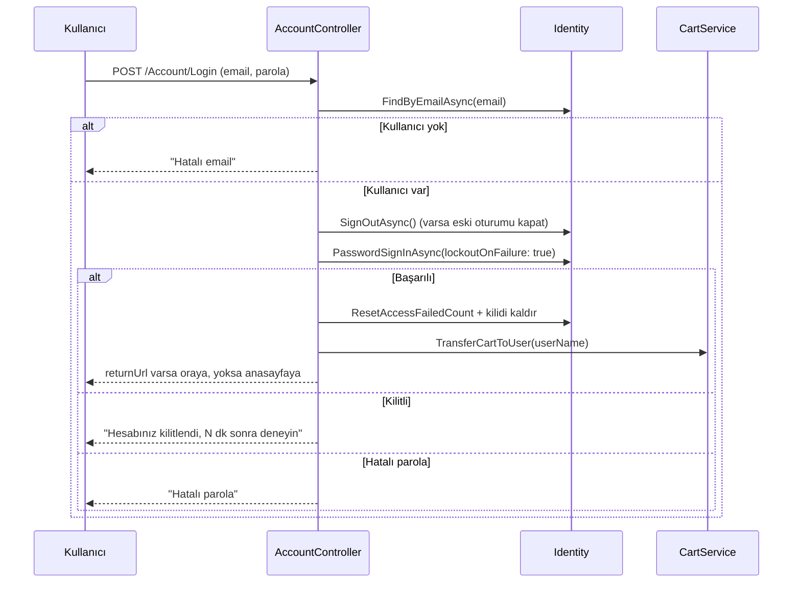
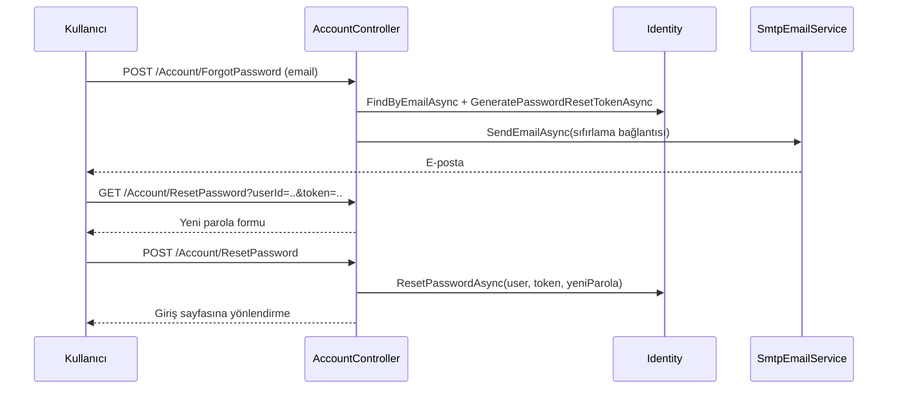

# 05 — Kimlik Doğrulama ve Yetkilendirme

Uygulama ASP.NET Core Identity kullanır. Kullanıcı ve rol tabloları `DataContext` içinde,
uygulamanın kendi tablolarıyla aynı veritabanında durur.

## Yapılandırma

```csharp
builder.Services
    .AddIdentity<AppUser, AppRole>()
    .AddEntityFrameworkStores<DataContext>()
    .AddDefaultTokenProviders();
```

`AddDefaultTokenProviders()` parola sıfırlama token'larının üretilebilmesi için gereklidir.
Anahtar tipi `int`'tir (`IdentityUser<int>` / `IdentityRole<int>`).

### Parola Politikası

| Ayar | Değer | Not |
|---|---|---|
| `RequiredLength` | 7 | |
| `RequireNonAlphanumeric` | `false` | Özel karakter zorunlu değil |
| `RequireDigit` | `false` | Rakam zorunlu değil |
| `RequireLowercase` | `false` | |
| `RequireUppercase` | `false` | |

Varsayılan Identity politikasına göre gevşetilmiştir; geliştirme kolaylığı içindir.

### Kullanıcı ve Kilitleme

| Ayar | Değer |
|---|---|
| `User.RequireUniqueEmail` | `true` |
| `Lockout.MaxFailedAccessAttempts` | **50** (kodda `//normally 5` notu var) |
| `Lockout.DefaultLockoutTimeSpan` | 3 dakika |

### Cookie Ayarları

| Ayar | Değer |
|---|---|
| `LoginPath` | `/Account/Login` |
| `AccessDeniedPath` | `/Account/AccessDenied` |
| `ExpireTimeSpan` | 30 gün |
| `SlidingExpiration` | `true` — her istekte süre yenilenir |

## Roller

Tek bir rol seed edilir: **`Admin`**. Rol içermeyen kullanıcılar normal müşteridir.

Yetkilendirme attribute tabanlıdır:

| Attribute | Anlam | Kullanıldığı yer |
|---|---|---|
| `[Authorize]` | Giriş yapmış olmak yeterli | `OrderController` (sınıf), `AccountController`'ın hesap action'ları |
| `[Authorize(Roles = "Admin")]` | Yalnızca Admin | `Admin`, `Kategori`, `Slider`, `Urun`, `User`, `Role` controller'ları ve `Order.Index` / `Order.Details` |
| `[AllowAnonymous]` | Sınıf kuralından muaf | `UrunController.List`, `UrunController.Details` |

Yetkisiz erişimde kullanıcı `/Account/AccessDenied` sayfasına, giriş yapmamışsa
`/Account/Login?returnUrl=...` adresine yönlendirilir.

## Seed Kullanıcılar

`SeedDatabase.Initialize` uygulama her başladığında çalışır ve **tablolar boşsa**
şunları oluşturur:

| Kullanıcı adı | Rol | Parola |
|---|---|---|
| `mustafaince` | `Admin` | `12345678` |
| `johnwick` | — (müşteri) | `12345678` |

> ⚠️ Bu değerler kaynak kodda sabittir. Gerçek bir ortama açılmadan önce mutlaka
> değiştirilmelidir.

Dikkat edilmesi gereken bir ayrıntı: seed kullanıcılarının `UserName` değeri e-posta
**değildir** (`mustafaince`), ancak `/Account/Create` üzerinden kayıt olan kullanıcılarda
`UserName = Email` olarak atanır. Giriş her iki durumda da e-posta ile yapılır
(`FindByEmailAsync`), fakat sepet kimliği `User.Identity.Name` yani `UserName` üzerinden
tutulduğu için iki grup arasında `CustomerId` biçimi farklıdır.

## Giriş Akışı



Başarılı girişte yapılan iki ek iş dikkat çekicidir:

1. **Kilit sayacı sıfırlanır** — başarılı girişten sonra geçmiş hatalı denemeler silinir.
2. **Sepet devri** — misafirken oluşan sepet kullanıcı hesabına taşınır
   (bkz. [04 — Servisler](04-servisler.md#transfercarttouserusername)).

## Parola Sıfırlama Akışı



E-posta gönderimi için `Email:*` ayarlarının tanımlı olması gerekir; tanımlı değilse
bu akış çalışmaz (bkz. [07 — Kurulum ve Çalıştırma](07-kurulum-ve-calistirma.md)).

## Kullanıcı ve Rol Yönetimi

Admin panelinden `UserManager` ve `RoleManager` üzerinden yönetilir:

- `/User/Index?role=Admin` — role göre filtrelenmiş kullanıcı listesi
- `/User/Edit/{id}` — kullanıcının bilgilerini ve rol atamalarını günceller
- `/Role/Edit/{id}` — rolün adını ve rolde bulunan kullanıcıları günceller

Endpoint listesi → [03 — Controller ve Rota Referansı](03-controller-ve-rotalar.md).
