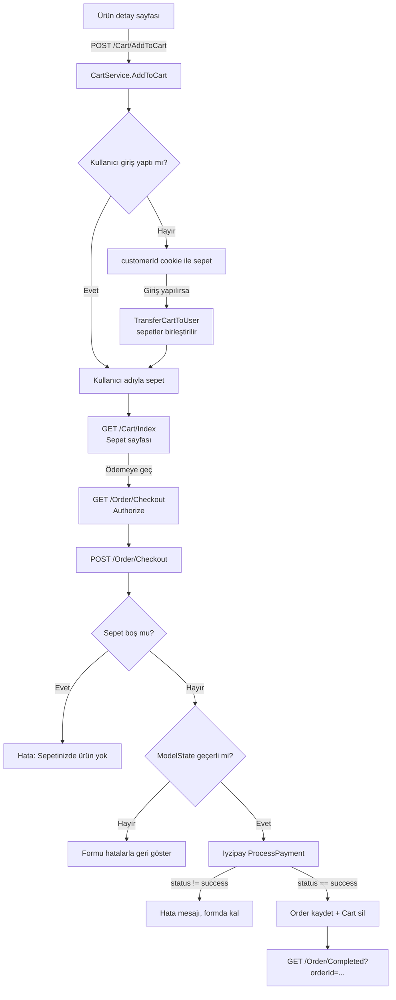

# 06 — Sepet, Sipariş ve Ödeme Akışı

Bu doküman, bir ürünün sepete atılmasından siparişin veritabanına yazılmasına kadar geçen
yolu anlatır.

## Uçtan Uca Akış



## 1. Sepet Aşaması

Sepet giriş gerektirmez. Misafir kullanıcı için tarayıcıya 1 ay ömürlü bir `customerId`
cookie'si yazılır ve sepet bu değere bağlanır. Kullanıcı giriş yaptığı anda misafir sepeti
hesabının sepetiyle birleştirilir; aynı ürün her iki sepette de varsa miktarlar toplanır.

Detay → [04 — Servisler](04-servisler.md).

## 2. Checkout Sayfası

`/Order/Checkout` `[Authorize]` altındadır — **ödeme için giriş zorunludur**. GET action'ı
sepeti `ViewBag.Cart` ile view'a taşır.

Form `OrderCreateModel` ile bağlanır:

| Alan | Doğrulama |
|---|---|
| `AdSoyad` | Zorunlu, 3–100 karakter |
| `Sehir` | Zorunlu, 2–50 karakter |
| `AdresSatiri` | Zorunlu, 10–250 karakter |
| `PostaKodu` | Zorunlu, `^\d{5}$` (5 hane) |
| `Telefon` | Zorunlu, `[Phone]`, 10–20 karakter |
| `SiparisNotu` | Opsiyonel, en fazla 500 karakter |
| `CartName`, `CartNumber`, `CartExpirationMonth`, `CartExpirationYear`, `CartCVV` | Kart bilgileri — **doğrulama attribute'u yok** |

Hata mesajları `{0}` / `{1}` yer tutucularıyla Türkçe tanımlanmıştır.

## 3. Sipariş Oluşturma

POST action'ı sırasıyla şunları yapar:

1. Kullanıcının sepetini alır, **boşsa** `ModelState`'e hata ekler.
2. `ModelState` geçerliyse bellekte bir `Order` nesnesi kurar:
   - Adres/iletişim alanları formdan kopyalanır
   - `SiparisTarihi = DateTime.Now`, `Username = User.Identity.Name`
   - `ToplamFiyat = cart.Toplam()` (**KDV dahil**)
   - Sepetteki her satır için `OrderItem` üretilir; `Fiyat` alanına **o anki** `Urun.Fiyat`
     yazılır — ürün fiyatı sonradan değişse bile sipariş etkilenmez
3. `ProcessPayment` ile Iyzipay'e ödeme isteği gönderir.
4. `payment.Status == "success"` ise: `Order` eklenir, `Cart` silinir, `SaveChangesAsync`
   çağrılır ve `Completed` sayfasına yönlendirilir.
5. Başarısızsa `payment.ErrorMessage` `ModelState`'e eklenir, kullanıcı formda kalır ve
   sepeti bozulmaz.

> ⚠️ **Tutar tutarsızlığı:** Siparişe `cart.Toplam()` (KDV dahil, `× 1.2`) yazılırken
> Iyzipay'e gönderilen `Price` / `PaidPrice` `cart.AraToplam()` (KDV hariç) değeridir.
> Yani kayıtlı sipariş tutarı ile gerçekte çekilen tutar birbirini tutmaz.
> Bkz. [08 — Geliştirme Notları](08-gelistirme-notlari.md).

## 4. Ödeme (`ProcessPayment`)

`OrderController` içindeki private metottur. Iyzipay .NET SDK'sını kullanır.

```csharp
options.ApiKey    = _configuration["PaymentApi:ApiKey"];
options.SecretKey = _configuration["PaymentApi:SecretKey"];
options.BaseUrl   = "https://sandbox-api.iyzipay.com";
```

`BaseUrl` **sandbox olarak kodda sabittir**; canlıya geçerken bu satırın konfigürasyona
taşınması gerekir.

İstek şu parçalardan oluşur:

| Parça | Kaynak |
|---|---|
| `Price` / `PaidPrice` | `cart.AraToplam()`, `InvariantCulture` ile `"0.00"` formatında |
| `Currency` | `TRY`, `Installment = 1`, `PaymentChannel = WEB` |
| `PaymentCard` | Formdaki kart alanları, `RegisterCard = 0` (kart saklanmaz) |
| `Buyer` | Kısmen formdan, kısmen **sabit** değerlerden |
| `ShippingAddress` / `BillingAddress` | Aynı adres, formdan |
| `BasketItems` | Sepet satırları — `Price = Fiyat × Miktar` |

> ⚠️ `Buyer` nesnesindeki `Surname`, `Email`, `IdentityNumber`, `Ip`, `LastLoginDate`,
> `RegistrationDate`, `RegistrationAddress` ve `BasketId` alanları sabit yazılmıştır;
> gerçek kullanıcı verisi taşımaz. Sepet satırlarındaki `Category1` da her ürün için
> `"Telefon"` gönderilir. Sandbox testi için sorun değildir, canlı kullanım için düzeltilmelidir.

Para birimi biçimlendirmesinde `CultureInfo.InvariantCulture` kullanılması bilinçlidir:
Türkçe kültürde ondalık ayırıcı virgül olduğundan, kültür belirtilmezse API'ye `1234,56`
gibi geçersiz bir değer giderdi.

## 5. Tamamlanma ve Geçmiş

- `/Order/Completed?orderId={id}` — teşekkür sayfası. View'a model olarak yalnızca sipariş
  id'si (string) geçilir.
- `/Order/OrderList` — kullanıcının kendi siparişleri; `Username` alanına göre filtrelenir,
  satırlar ve ürünler `Include` ile birlikte yüklenir.
- `/Order/Index` ve `/Order/Details/{id}` — yalnızca `Admin` rolü; tüm siparişleri görüntüler.

## Fiyat Hesabı Özeti

| Hesap | Formül | Nerede kullanılır |
|---|---|---|
| Ara toplam | `Σ (Fiyat × Miktar)` | Sepet ekranı, Iyzipay `Price` |
| Toplam | `Ara toplam × 1.2` | Sepet ekranı, `Order.ToplamFiyat` |

KDV oranı `%20` olarak `Cart.Toplam()` ve `Order.Toplam()` metotlarında sabit `1.2`
çarpanıyla gömülüdür; ayrı bir konfigürasyon alanı yoktur.
